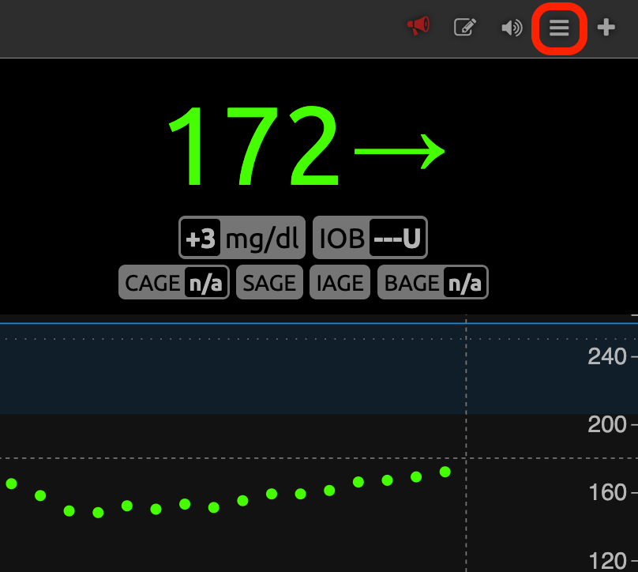
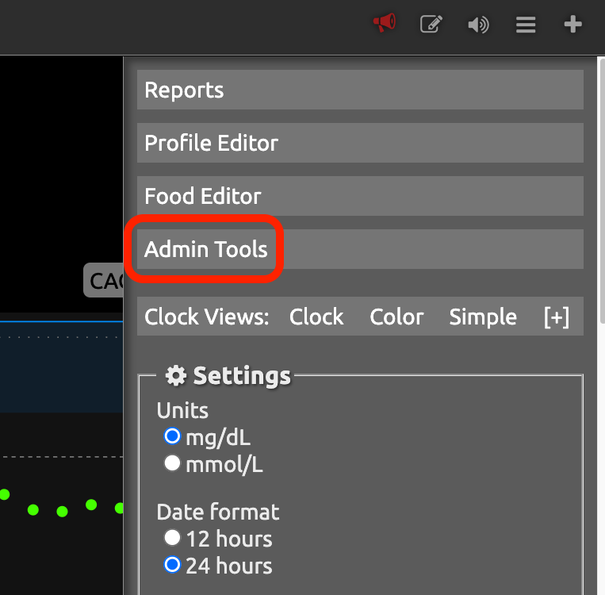
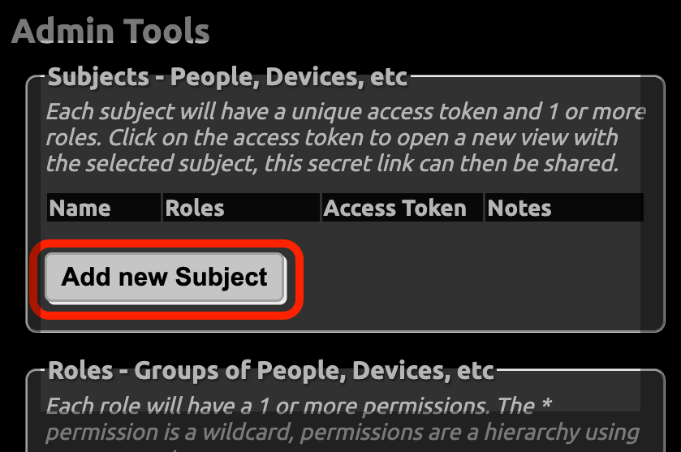
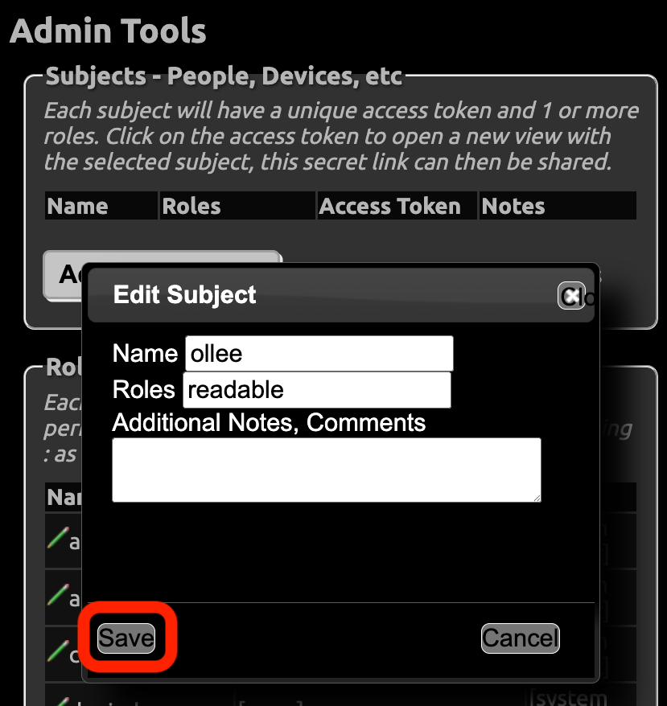
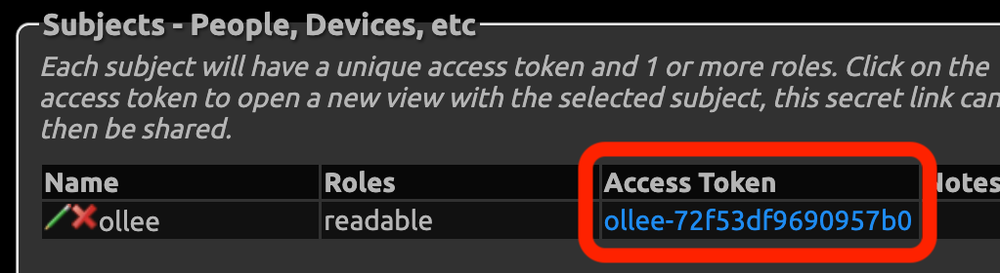

# Nightscout Setup Guide

This guide walks you through configuring Nightscout to provide glucose data to Ollee Glycemia. Nightscout allows you to access your CGM data remotely through an API, providing real-time glucose readings to your Ollee Watch.

## Prerequisites

- Nightscout instance set up and running (e.g., via [Heroku, Railway, T1Pal, Nightscout na Mikr.us-ie, or self-hosted](https://nightscout.github.io/nightscout/new_user/))
- Access to your Nightscout admin panel
- Ollee Glycemia app installed on your Android device
- Your CGM (Dexcom, FreeStyle Libre, Medtronic, etc.) configured to upload data to your Nightscout instance

## Step-by-Step Setup

### Step 1: Open Nightscout Admin Tools

Log in to your Nightscout instance and click the **hamburger menu** (three horizontal lines) in the top-right corner to access the admin panel.

### Step 2: Navigate to Admin Tools

From the menu, select **Admin Tools**. This will take you to the administration dashboard where you can manage subjects and access tokens.

### Step 3: Create a New Subject

In the Admin Tools page, under the **"Subjects - People, Devices, etc"** section, click the **"Add new Subject"** button to create a new application token for Ollee Glycemia.

### Step 4: Configure the Subject

A dialog box titled **"Edit Subject"** will appear. Fill in the following:

- **Name**: Enter a descriptive name for this subject (e.g., `ollee`)
- **Roles**: Select **`readable`** to grant read-only access to glucose data
- **Additional Notes** (optional): You can add notes like "Ollee Watch App" for reference

Click **Save** to create the subject.

### Step 5: Copy the Access Token

After saving, the subject will appear in the subjects list. Look for the **"Access Token"** column and copy the generated token (it will look like a long alphanumeric string, e.g., `ollee-72f53df9690957b0`).

### Step 6: Setup Nightscout in Ollee Glycemia

1. Open **Ollee Glycemia** on your Android device
2. In **Glycemia Source** tap on change icon (two arrows)
3. Select **Nightscout** from the list of available providers
4. Enter your Nightscout details:
   - **Nightscout URL**: Your full Nightscout instance URL (e.g., `https://myname.herokuapp.com` or `https://nightscout.example.com`)
   - **Nightscout Token**: Paste the access token you copied in Step 5
5. Tap **Test connection** to verify the settings
6. Tap **Save** to apply the configuration

## Testing the Connection

1. After saving your configuration, Ollee Glycemia will automatically fetch glucose data from Nightscout
2. Within 30 seconds, you should see a glucose reading appear in the app
3. The reading will automatically sync to your paired Ollee Watch
4. The app will continue to fetch new readings every 5 minutes (default interval)

## Troubleshooting

### "Connection Failed" or "Unauthorized" Errors

- Verify your **Nightscout URL** is correct and includes the protocol (https://)
- Confirm your **Nightscout Token** was copied completely (should be at least 20 characters)
- Ensure the subject has the **"readable"** role assigned
- Check that your Nightscout instance is accessible from your phone (try opening the URL in your browser)

### No glucose readings appear

- Verify that your Nightscout instance is receiving data from your CGM
- Check that your Nightscout URL and API Token are correct in Ollee Glycemia settings
- Try the **"Test connection"** button to see the exact error message
- Wait a few minutes for the first data point to arrive from Nightscout
- Check your Android device logs for any error messages related to Nightscout

### Readings stopped updating

- Verify your Nightscout instance is still running and accessible
- Check that your CGM is still uploading data to Nightscout
- Restart the Ollee Glycemia app
- Verify your API Token hasn't been revoked or changed

### How to Update Your API Token

If you need to change your API token for security reasons:
1. Go back to Nightscout Admin Tools
2. Find your subject (e.g., "ollee") in the subjects list
3. Click the access token to generate a new one or delete and recreate the subject
4. Update the new token in Ollee Glycemia settings

## Additional Notes

- **Read-Only Access**: The "readable" role only allows Ollee Glycemia to view glucose data; it cannot modify or delete any Nightscout data
- **Data Privacy**: Your API token is stored locally on your device and is never shared with third parties
- **Fetch Interval**: By default, Ollee Glycemia fetches new readings every 5 minutes. This can be adjusted in advanced settings if needed
- **Multiple Instances**: You can configure multiple Nightscout instances if you have access to more than one
- **Nightscout URL Format**: Use `https://` for secure connections; `http://` is only recommended for local/private networks

## Common Nightscout URLs

- **Heroku-deployed**: `https://yourname.herokuapp.com`
- **Railway-deployed**: `https://yourname.up.railway.app`
- **Nightscout na Mikr.us-e**: `https://yourname.ns.techdiab.pl`
- **Self-hosted**: Use your custom domain or IP address (e.g., `https://ns.example.com`)

If you're unsure about your Nightscout URL, check:
1. The URL shown in your browser when you access your Nightscout instance
2. Your Nightscout deployment confirmation email
3. Your hosting platform's dashboard

## Need Help?

- Check your Nightscout instance logs for any API access errors
- Ensure both your phone and Nightscout instance have active internet connections
- Verify that your firewall or ISP isn't blocking HTTPS connections to your Nightscout URL
- Review Nightscout's official documentation at https://nightscout.github.io/
