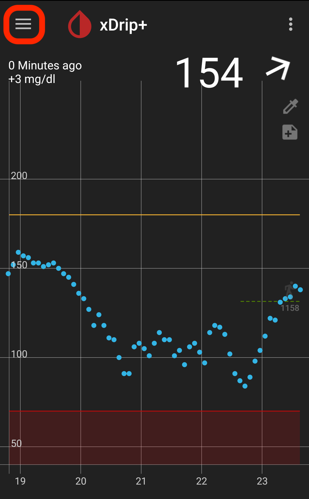
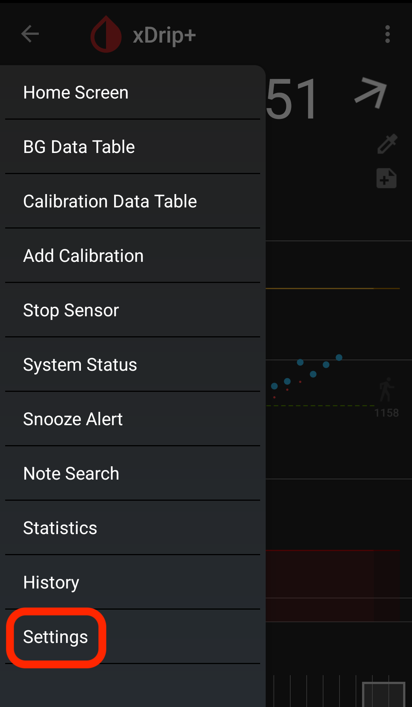
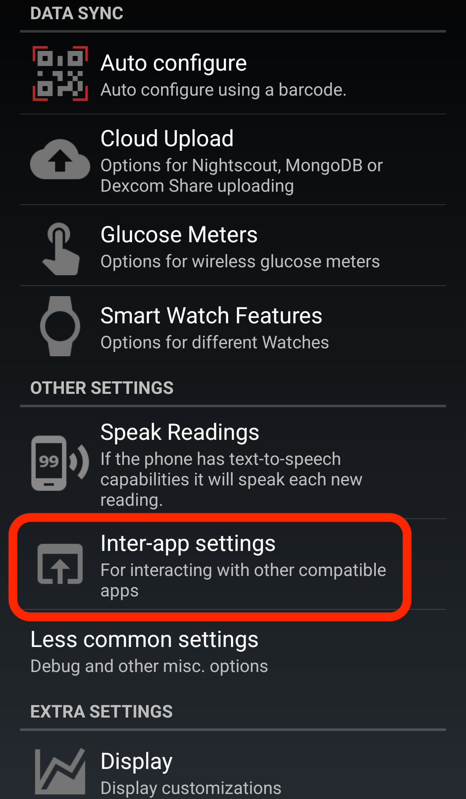
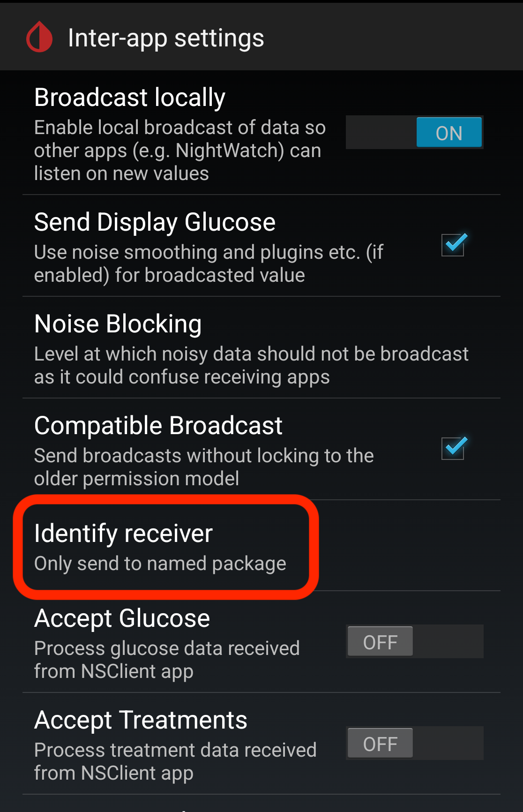
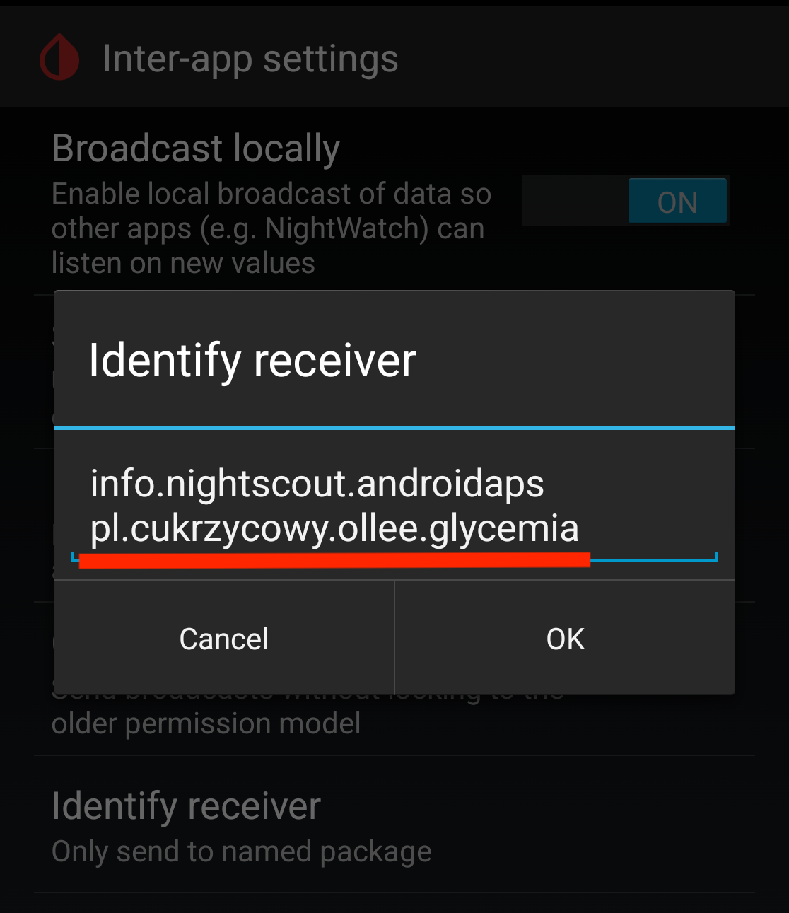

# xDrip+ Setup Guide

This guide walks you through configuring xDrip+ to broadcast glucose data to Ollee Glycemia. The most critical step is correctly adding the Ollee Glycemia package name to the broadcast receivers list.

## Prerequisites

- xDrip+ app installed on your Android device
- Ollee Glycemia app installed on the same device

## Step-by-Step Setup

### Step 1: Open xDrip+ and Click the Menu

Open the xDrip+ app and tap the **hamburger menu** (three horizontal lines) in the top-left corner.



### Step 2: Go to Settings

In the menu, scroll down and tap **Settings** at the bottom of the list.



### Step 3: Open Inter-app Settings

In the Settings page, scroll down to the "OTHER SETTINGS" section and tap **Inter-app settings**.



### Step 4: Click "Identify Receiver"
In the Inter-app settings page, ensure **"Broadcast locally"** is set to **ON**, then scroll down and tap **"Identify receiver"**.



### Step 5: Add Ollee Glycemia Package Name

A dialog will appear with a text field showing existing package names. Enter the Ollee Glycemia package name:

```
pl.cukrzycowy.ollee.glycemia
```

**⚠️ Important**: If other receiver apps are already configured (e.g., AAPS with `info.nightscout.androidaps` or other apps), **add Ollee Glycemia at the end** with a **space separator**:

```
info.nightscout.androidaps pl.cukrzycowy.ollee.glycemia
```

Do not remove existing receivers—just append our package name at the end with a space between.

Tap **OK** to save.



## Testing the Connection

1. Open Ollee Glycemia
2. Select or pair your Ollee Watch (see main [README.md](../../README.md#getting-started))
3. Ensure `xDrip` glycemia source is selected
4. Within 5-10 minutes, you should see a glucose reading appear on your watch

## Troubleshooting

### Quick checklist if glucose data is not syncing
- Verify that xDrip+ is running and actively receiving glucose readings
- Check that "Broadcast locally" is turned **ON** in Inter-app settings
- Verify the package name is entered exactly: `pl.cukrzycowy.ollee.glycemia`
- Restart both apps and try again

### No glucose readings appear
- Open xDrip+ and verify it's receiving readings from your CGM
- Go to Inter-app settings and confirm "Broadcast locally" is **ON**
- Re-verify the package name in "Identify Receiver"

### Multiple apps already configured
- When adding Ollee Glycemia, use a **space separator** between package names (not newlines or commas)
- Example: `info.nightscout.androidaps pl.cukrzycowy.ollee.glycemia`

### Ollee Glycemia still shows "No Data"
- Ensure Ollee Glycemia has been granted the necessary permissions
- Wait 5-10 minutes for the first reading to arrive
- Check that your watch is properly paired and connected via Bluetooth
- Try removing and re-adding the package name in "Identify Receiver"
